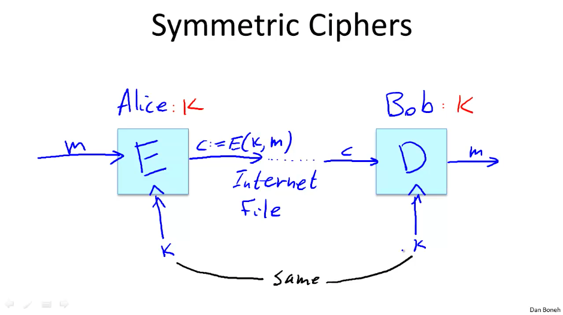
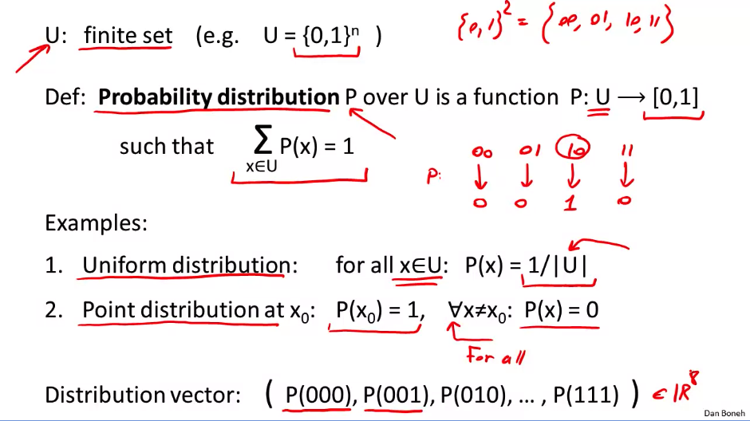
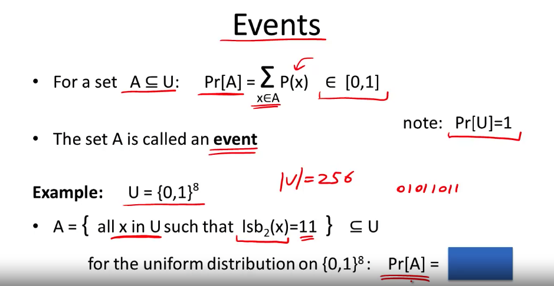
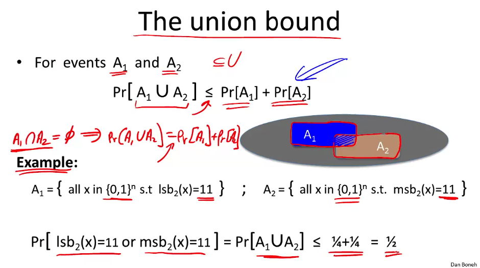

# Section 1: Intro and History

Some overviews on what crypto is, what it's good for, and what the course looks like. Mostly skipped here.

## History of Cryptography

Symmetric ciphers are the very beginnings. You use the same key to encrypt and decrypt the message.

The most obvious one of these is a substitution cipher (a = z, b = x, ... e.g. [Caesar Cipher](https://en.wikipedia.org/wiki/Caesar_cipher)). These are easily broken with frequency attacks. Just check what the most common characters and character combinations are in the language you're using, start matching things up, bada bing bada boom.

A little better is the [Vigenère cipher](https://en.wikipedia.org/wiki/Vigen%C3%A8re_cipher) where you create a worded key, match the key with the text, then do `(key_letter + message_letter) % 26 == encrypted_letter`. If the key is something like `crypto` and the message is longer, you just repeat the key to match. Herein lies the vulnerability, if we know the length of the key, we can figure out all letters encrypted with K1, then K2, etc. We can also brute force this by just guess-checking the length of the key.

Even better is [Rotor machines](https://en.wikipedia.org/wiki/Rotor_machine), which kept a secret key as part of its disk, and each key press moved the disk to change the substitution table with every key press. This got continuously busted until it led to [The Enigma Machine](https://en.wikipedia.org/wiki/Enigma_machine), each one making more and more complex rotor key systems. Turing busted this up with similar methods (but with computers!) and this kicked off the "data-age" of encryption where ciphers, no matter how convoluted, ain't gonna cut it anymore.

# Section 2: Discrete Probability Crash Course

Discrete probability is always defined over a `universe` or `U`. For our purposes, this will always be a finite set, very commonly the set of all n bit strings, denoted as `U = {0,1}^n`. So if `n = 2`, then `U = {00, 01, 10, 11}`. This universe is one where each element has a discrete probability of happening, and each of these probabilities adds up to 1. For example `00 = .25, 01 = .25, 10 = .5, 11 = 0`.

The 2 most basic distributions are the uniform distribution and the point distribution.

## Events

Consider `A` as a subset of our universe `U`. The probability of A `Pr[A]` is equal to the sum of all the probabilities of the elements in A, which can equal `[0, 1)`. In this case, the subset `A` is referred to as an **event**, and `Pr[A]` is the probability of that event.

*Quiz Question*

An example of an event could be that we have a universe `U = {0, 1}^8`, a set of all possible byte values. Our event `A` could be all elements in `U` that have the least significant bits `11`. If we assumes that `U` has a uniform distribution, what is `Pr[A]`?

*Answer*

50% of `U` has lsb1 = 1, so I'm guessing 25% of `U` has lsb2 = 11. (Correct! By the way, the Coursera text input expects `0.25`, not `25%`).

### Union Bound

If we have 2 events, A1 and A2, we can calculate the probability that either A1 or A2 occurs as less than or equal to the sum of both of them. That's because we double-sum elements in the intersection of the two probabilities.

The above assumes that A1 and A2 intersect somewhat. If they are **disjoint**, then the probability of either of them happening is equal to exactly their sum.

## Random Variables

A random variable is a function that acts on universe `U` and produces a set `V`, and that's where its values come from. Soo... a function, mostly, but with shitty syntax. Can I say that math sucks at this? CS has the joy of regimentation, if you put a bracket where you should put a paren, the computer tells you to get fucked. If you do that in math, you're just "creative" or some dumb shit. I don't care if you don't want to write 15 nested parentheses, I didn't see you assign no variables.

## Randomized Algorithm

... Also a function which is also a random variable, but this time actually with some randomness thrown in as an input? This is going to bite me in the ass later, but I'm having a hard time seeing the distinctions between these.