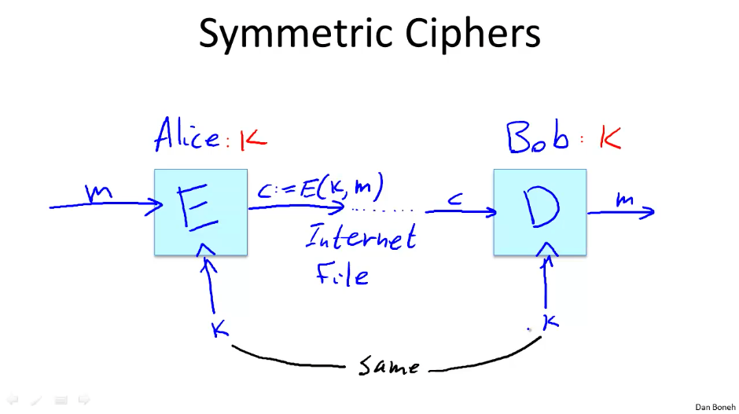

# Section 1: Intro and History

Some overviews on what crypto is, what it's good for, and what the course looks like. Mostly skipped here.

## History of Cryptography

Symmetric ciphers are the very beginnings. You use the same key to encrypt and decrypt the message.

The most obvious one of these is a substitution cipher (a = z, b = x, ... e.g. [Caesar Cipher](https://en.wikipedia.org/wiki/Caesar_cipher)). These are easily broken with frequency attacks. Just check what the most common characters and character combinations are in the language you're using, start matching things up, bada bing bada boom.

A little better is the [Vigenère cipher](https://en.wikipedia.org/wiki/Vigen%C3%A8re_cipher) where you create a worded key, match the key with the text, then do `(key_letter + message_letter) % 26 == encrypted_letter`. If the key is something like `crypto` and the message is longer, you just repeat the key to match. Herein lies the vulnerability, if we know the length of the key, we can figure out all letters encrypted with K1, then K2, etc. We can also brute force this by just guess-checking the length of the key.

Even better is [Rotor machines](https://en.wikipedia.org/wiki/Rotor_machine), which kept a secret key as part of its disk, and each key press moved the disk to change the substitution table with every key press. This got continuously busted until it led to [The Enigma Machine](https://en.wikipedia.org/wiki/Enigma_machine), each one making more and more complex rotor key systems. Turing busted this up with similar methods (but with computers!) and this kicked off the "data-age" of encryption where ciphers, no matter how convoluted, ain't gonna cut it anymore.