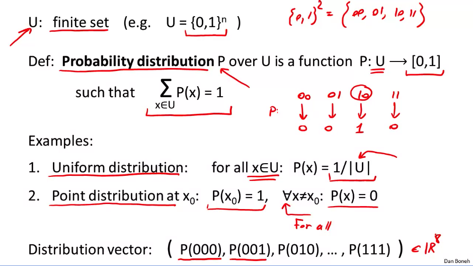
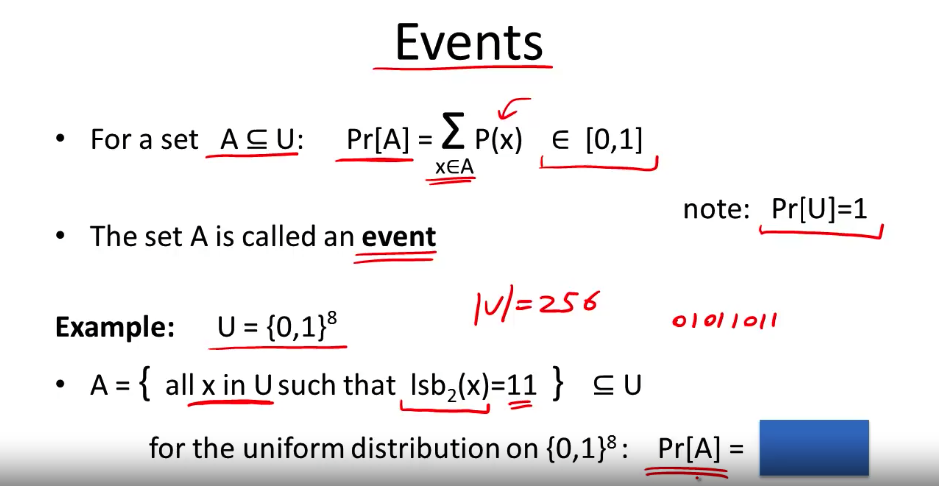
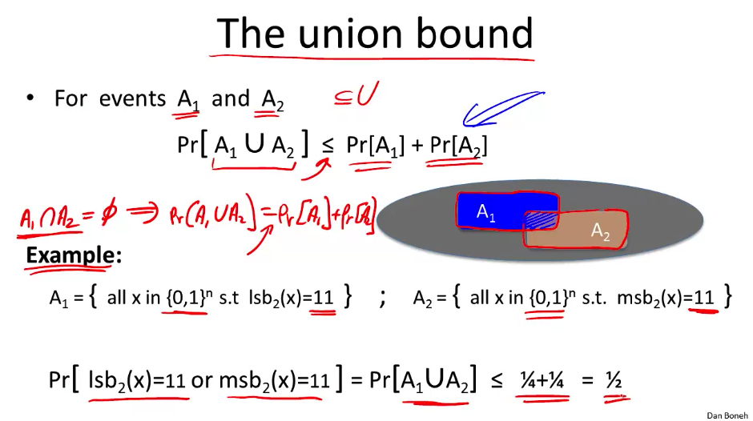
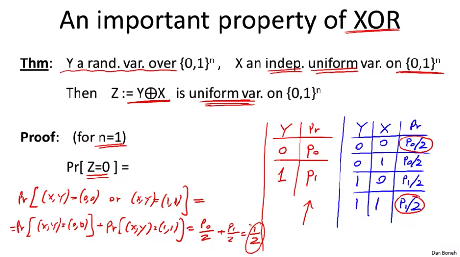
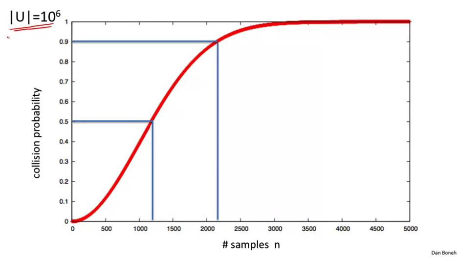

# Section 2: Discrete Probability Crash Course

Discrete probability is always defined over a `universe` or `U`. For our purposes, this will always be a finite set, very commonly the set of all n bit strings, denoted as `U = {0,1}^n`. So if `n = 2`, then `U = {00, 01, 10, 11}`. This universe is one where each element has a discrete probability of happening, and each of these probabilities adds up to 1. For example `00 = .25, 01 = .25, 10 = .5, 11 = 0`.

The 2 most basic distributions are the uniform distribution and the point distribution.

## Events

Consider `A` as a subset of our universe `U`. The probability of A `Pr[A]` is equal to the sum of all the probabilities of the elements in A, which can equal `[0, 1)`. In this case, the subset `A` is referred to as an **event**, and `Pr[A]` is the probability of that event.

### Union Bound

If we have 2 events, A1 and A2, we can calculate the probability that either A1 or A2 occurs as less than or equal to the sum of both of them. That's because we double-sum elements in the intersection of the two probabilities.

The above assumes that A1 and A2 intersect somewhat. If they are **disjoint**, then the probability of either of them happening is equal to exactly their sum.

## Random Variables

A random variable is a function that acts on universe `U` and produces a set `V`, and that's where its values come from. Soo... a function, mostly, but with shitty syntax. Can I say that math sucks at this? CS has the joy of regimentation, if you put a bracket where you should put a paren, the computer tells you to get fucked. If you do that in math, you're just "creative" or some dumb shit. I don't care if you don't want to write 15 nested parentheses, I didn't see you assign no variables.

## Randomized Algorithm

... Also a function which is also a random variable, but this time actually with some randomness thrown in as an input? This is going to bite me in the ass later, but I'm having a hard time seeing the distinctions between these.

## Independence

2 events A and B are **independent** if Pr[A] and Pr[B] don't effect each other at all. Formally, this means that `Pr[A and B] = Pr[A] * Pr[B]`. The same can apply to random variables, so if `X` and `Y` have nothing to do with each other, you could say that `Pr[X=a and Y=b] = Pr[X = a] * Pr[X = b]`.

## XOR

Cryptography uses XOR a shitload. An important reason for this is that if we define `Y` as a random variable over {0, 1}^n, and `X` as an independent, **uniform** random variable over the same universe, if we XOR `Y` and `X`, then we get a **uniform** random variable on that universe. So we could take some arbitrarily malicious random variable `Y`, XOR it with our trusted variable `X`, and the result will be uniform.

## Birthday Paradox

If we let `r1`,...,`rn` be independent, random variables that are *identically distributed*, then when `n` is sufficiently large, then the probability of 2 `r` variables being equal is greater than or equal to 1/2. `Pr[there exists i != j: ri = rj] >= 1/2`. This is usually described as the [birthday problem](https://en.wikipedia.org/wiki/Birthday_problem). This isn't quite the same, as birthdays aren't quite uniform, or even independent sometimes, but it's good enough. It's also not a paradox, just unintuitive.

