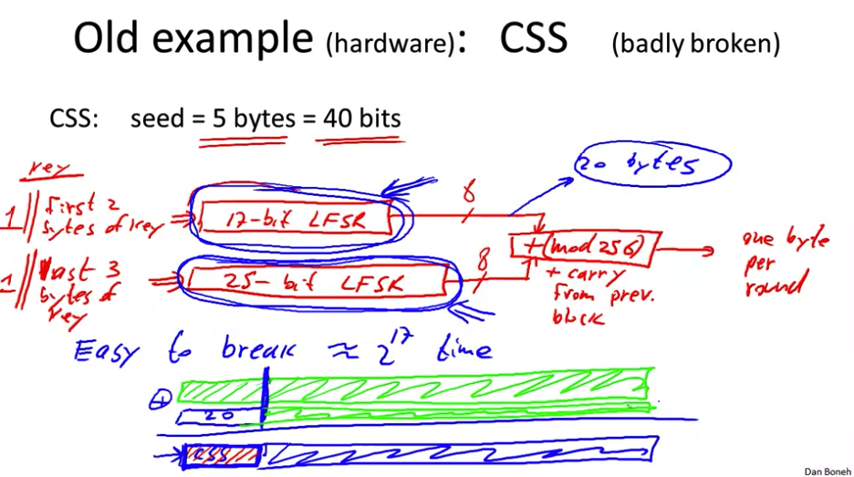

# Real World Examples

Some examples of stream ciphers that we use in real life.

## RC4: Old, 1987

RC4 takes in a seed, and expands it to 2048 bits to generate output, 1 byte per round. It's used in HTTPS and WEP, but is no longer recommended as it has some weaknesses:

1. Bias in initial output, `Pr[2nd byte = 0] = 2/256`
2. As output grows, `Pr[(0,0)]` grows, making it easier to break
3. Related keys attack

## CSS: Old, broken way to encrypt DVD movies

It's a hardware stream cipher, something that's easy to implement on low-level hardware, great for DVD players. It operates using a [linear feedback shift register (LFSR)](https://en.wikipedia.org/wiki/Linear-feedback_shift_register). A big part of the reason it got broken so badly was that at the time, U.S. regulation restricted exporting crypto algorithms with keys longer than 40 bits. So CSS used a 17-bit LFSR and a 25-bit LFSR. Problem is that DVD files have a known prefix that is getting encrypted, and the keyspace is small enough that we can just brute-force guess the prefix part for the key until we find the state of the LFSR.

## eStream: Modern Stream Ciphers

A group of 5 modern stream ciphers created in 2008 that are still good. These PRGs utilize a **nonce** along with the seed for the key so that `{0,1}^s x nonce = {0,1}^n where n >> s`. Some ciphers are designed specifically with hardware in mind, or with software in mind. eStream as a group has a few different approaches.
