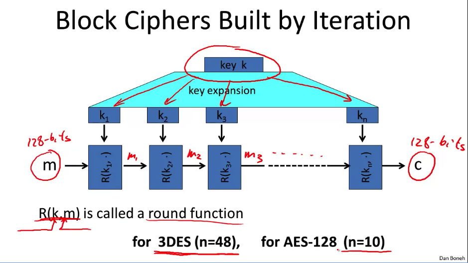
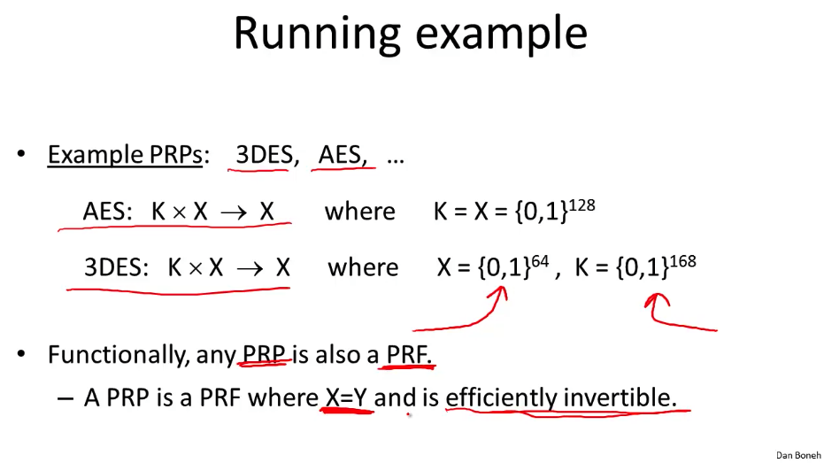
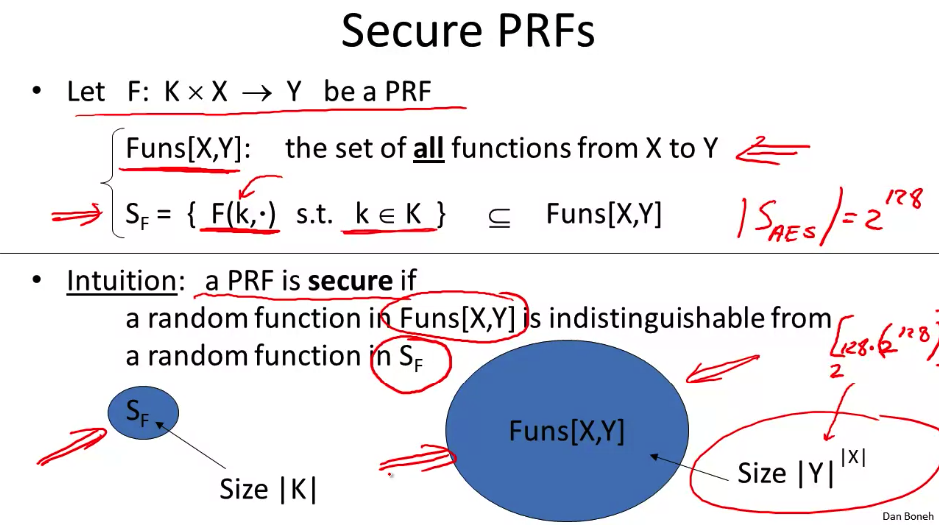
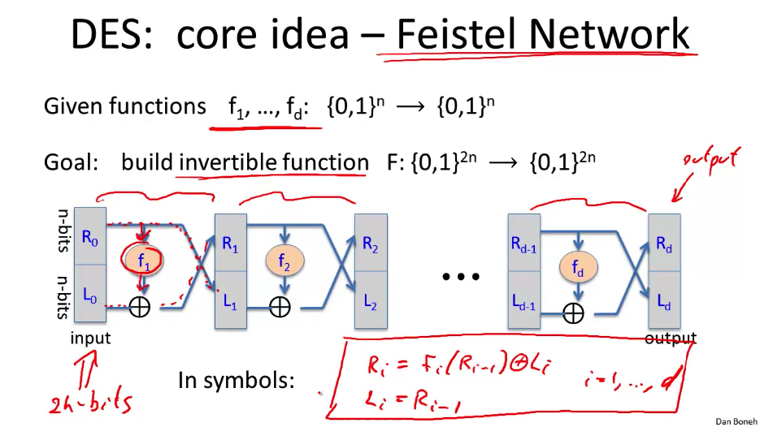
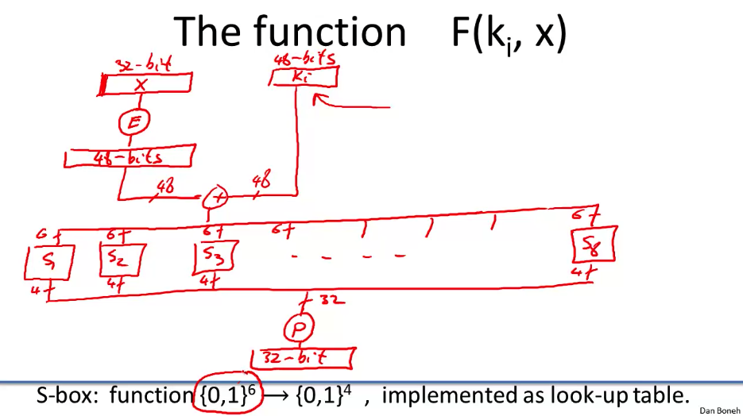
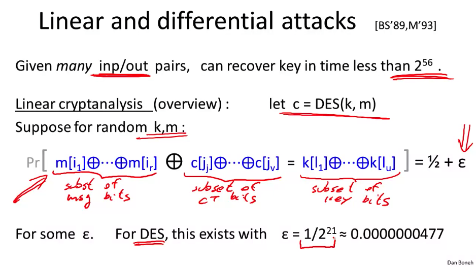
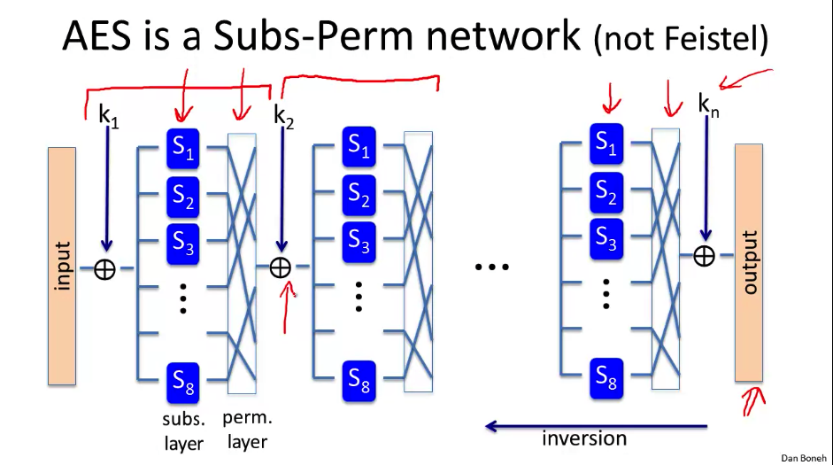

# Block Ciphers Overview

Block ciphers are like the cooler, stronger older brother of stream ciphers. If a block cipher is given `n` bits of input, it will pop out `n` bits of output. The big boy examples here are [3DES](https://en.wikipedia.org/wiki/Triple_DES) (`n = 64 bits, k = 168 bits`) and [AES](https://en.wikipedia.org/wiki/Advanced_Encryption_Standard) (`n = 128 bits, k = 128,192,256 bits`).

Block ciphers are built by iteration. They expand their key into kn parts, and use a **round function** to encrypt them with each key. So you round function with R(k0, m), then stick that result in the next round function, R(k1, m), etc... These end up being quite a bit slower to build than stream ciphers, but also allow us to do certain things very efficiently that we'll talk about later.

## PRPs and PRFs

We're going to take a detour into abstractions to help us understand things, Pseudo Random Functions (PRFs) and Pseudo Random Permutations (PRP).

A PRF is a function defined over `(K, X, Y)` so it takes a key and an input space, and maps to some element in the output space: `F(K, X) -> Y`, and their must be an "efficient" algorithm to evaluate `F(K, X)`.

A PRP is defined over `(K, X)`, where `F(K, X) -> X` and has the following requirements:

1. There exists and "efficient" deterministic algo to evaluate `F(K, X)`.
2. The function `F(K, .)` is one-to-one
3. There exists an "efficient" inversion algorithm.

A PRP is basically an abstract way of defining a block cipher, and some people use the terms interchangeably. (I'm not 100% on this yet, I'm not sure why this is useful at all, given it's one-to-one? Maybe I'm misunderstanding that?)

## Secure PRFs

Let's look at how a PRF and PRP are made secure so we can apply that to how block ciphers are secure. It seems pretty similar to how we define a secure pseudo-random generator, where we're secure if a random function in the set of all possible functions `F(K,X)` (a massive amount) is indistinguishable from a pseudo-random function in Sf.

My intuition was right about this being similar to PRGs, as we can map a PRF to a PRG easily. If we have a PRF `F(K, {0, 1}^n) -> {0, 1}^n`, then we can have a PRG `G(K) = F(K, 0) | F(K, 1) | ... F(K, t)`. The cool thing here is that this equation is parallelizable. Each of the `F(K, t)` equations can have their own thread.

## The [Data Encryption Standard (DES)](https://en.wikipedia.org/wiki/Data_Encryption_Standard)

DES was a national standard, originating from IBM in the 70s. It had a tiny key length by modern standards (56 bits) and was broken by **exhaustive search** in 1997. In 2000, NIST replaced it with AES. It was super popular, used in ACH transfers and most of the web.

## Core Idea: [Feistel Network](https://youtu.be/FGhj3CGxl8I?si=1ITvkDg0UPeRI9Jf)

This is a handy method for building invertible functions (block ciphers) from arbitrary functions. Used in a lot of block ciphers, but not in AES. But DES is a 16 round Feistel network. Calling back to how basic block-ciphers work, we expand our key to however many rounds we need, and in this case, our round function it the Feistel network steps, and we pass it through 16 times with our 16 different keys. We can also decrypt it using the same method, as the function is reversible.

(There's a lot of steps here that are just mapping and permuting different shit around, seemingly arbitrarily? Not sure why, doesn't seem to be too important for our case.)

The actual functions fd are defined as below.

Supposedly, the magic here is in the S boxes, which is a lookup table that maps 6 bit inputs to 4 bit outputs. Why? Well let's think about bad ways to do it, like a linear approach where all we do is XOR the 6 bit inputs to get our 4 bit outputs. This would cause it to be totally insecure, as the only thing it does is shuffle bits around without any sort of obfuscation. (I'm a little lost here? Probably need to return back to why this is really a problem, as I'm not seeing much of a distinction. But the overall point is that these S box tables have been specially chosen so that the cipher isn't easily broken, as most other options seem to lead to an insecure cipher.)

## Exhaustive Search Attacks

A common attack on block ciphers are exhaustive search attacks. If we suppose that DES is an ideal cipher, we can know with high probability (99.5%) that there is only one key that will map that input to that output. So we can start brute force guessing. And if we manage to get 2 pairs, the probability basically becomes 100% that there's only one key. In the 90s, RSA announced the [DES challenge](https://en.wikipedia.org/wiki/DES_Challenges) where RSA published 3 message-cipher pairs, and a bunch of ciphers for people to try and crack. In 1997, it took 3 months to brute force the key. In 1998, a special machine was built called deep crack to break it in 3 days. As hardware has gotten faster, it's gotten much faster and cheaper to break these, and so DES, and any other 56-bit ciphers are long dead.

So, we need a new encryption standard. First thought was [3DES](https://en.wikipedia.org/wiki/Triple_DES), where we do DES but with triple the keys, so now we have 3x56 = 168-bit keys, which would take all the hardware in the world thousands of years to break. But it's now 3 times slower than plain old DES. Why not double it instead of triple? Because double would be vulnerable to a [meet-in-the-middle-attack](https://en.wikipedia.org/wiki/Meet-in-the-middle_attack). Because a double DES would look like `E(k1, E(k2, m)) = c`, which we can simplify to `E(k2, m) = D(k1, c)`, and anytime we have 2 independent keys on either side of the equation, it's probably going to have issues with meet-in-the-middle attacks.

## More Attacks on Block Ciphers

Here follows some examples of block cipher attacks. Suffice to say, consider this a warning when thinking of rolling your own crypto, and stick to AES. (Though, I would think in a cryptography class, you eventually are going to talk to someone who will in fact NEED to roll their own crypto. So when does that rule first get "broken" I wonder?)

* You can measure power/time/cpu usage that the encryption algorithm uses to figure out the keys. This is especially an issue with low-powered devices like smart cards. (Side-Channel attacks)
* Similar to above, you can watch for cache misses when the encryption is happening to get a sense of the keys being used.
* If there are errors in the last round of encryption (like if I flip some bits or heat up the machine) then the output can expose the key. (Fault attacks)

### [Linear Attacks](https://en.wikipedia.org/wiki/Linear_cryptanalysis)

DES is susceptible to this as one of its S-boxes is too close to a linear function, so that propagates through the rest of the cipher to mean that some message and cipher xors have a linear relationship to some keys. Assuming the encryption is susceptible to this, if we have enough pairs, we can figure out a good portion of the key faster than exhaustive search.

### Quantum Attacks

[Computerphile video](https://youtu.be/BYx04e35Xso?si=yzToSjb5zxxJKh1m)

Quantum computers can break a lot of shit. For example, if we have a function `f(x)` that outputs either 1 or 0, and only outputs 1 for a single input, and we want to find that input, a normal computer is just going to have to guess for all values of x. But a quantum computer can do so in a square root of all those values. (Theoretically, we don't actually know if we can build a big enough quantum computer to do this stuff, as of the taping of this lecture.)

## AES Block Cipher

[Computerphile also here](https://youtu.be/O4xNJsjtN6E?si=t79A78xAjk4ryxry).

In the late 90s, NIST was asking around for new standards as DES and 3DES were too slow, and in 2000 they chose Rijndael as AES. It has 3 possible key sizes, with larger keys being more secure, but slower execution. AES uses a Subs-Perm (Substitutions-Permutations) network instead of Feistel.

AES operates entirely on 4x4 grids of bytes, each round includes an xor, a substitution, and a permutation, utilizing the corresponding round key.

AES is entirely made up of mathematical operations over a finite field (or [Galois field](https://en.wikipedia.org/wiki/Finite_field)). Which means no matter what operations we make on the values in the field, we stay within the field, which is some sort of range, like {0,1}n.

### Attacks

* The best key recovery attack is 4 times faster than exhaustive search, but with a 128-bit key, it still isn't exactly feasible.
* You can do a [related key attack](https://en.wikipedia.org/wiki/Related-key_attack) on AES-256, provided you have 299 input-output pairs from **four closely related keys**, you can get those keys in 299 time, which is still not great.
