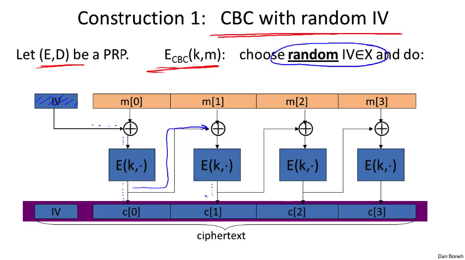
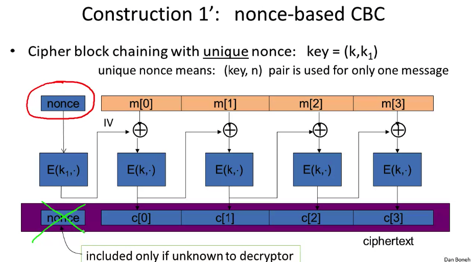
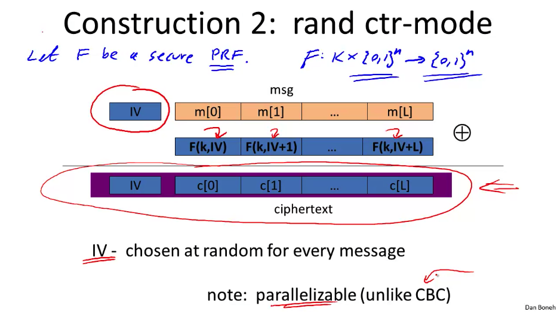

# How To Use Block Ciphers

We know what they are, now let's put them to use to encrypt some actual messages, the process of which is called a [mode of operation](https://en.wikipedia.org/wiki/Block_cipher_mode_of_operation).

## PRP and PRF Review

* PRF is a function that takes two inputs, `K` and some field `X` and outputs `Y` such that **there exists and efficient algorithm to evaluate F(K, X)**.
* A PRP is similar to a PRF, but there must also exist an "efficient" inversion algorithm.
* A PRF is secure if a set of all functions across `X` and `Y` is indistinguishable from the set of functions possible with `K`.
* **PRF Switching Lemma**: Any secure PRP is also a secure PRF, if the size of `X` is sufficiently large.

## [Electronic Code Book (ECB)](https://www.geeksforgeeks.org/block-cipher-modes-of-operation/): How NOT to Use a PRP

ECP is a mode of operation for block ciphers that is badly broken and should not be used. You break your message up into blocks, and cipher each of them, pretty straightforward. Problem is that if any of those blocks equal each other, you can start sussing out some info about the plain text, as you clearly just encrypted the same value twice.

## Many Time Key

We want to use the same key to encrypt many messages, but remember many time pad when we tried that, adversaries could figure things out if they had enough ciphers to compare with each other. The adversary can execute a chosen-plaintext attack (CPA) where the adversary can send a bunch of their own messages through the encryption, check their resulting cipher, and can use those to try and come up with the key, or even just figure out that two encrypted values are the same in plaintext, which is too much info to be semantically secure. If we want to be semantically secure and use the same key many times, then your encryption algo better produce different ciphers if I encrypt the same thing twice. Two ways to do that:

1. **Randomized Encryption**: On each encryption run, you throw some random bits in there (kind of like a randomized salt). This works fine, but makes your ciphers can be a lot bigger as you'll need some big random numbers.
2. **Nonce Based Encryption**: You know what it is. The fun bit is that, to be semantically secure, you nonce based encryption needs to be good even when the adversary gets to choose the nonce.

So how can we use these to make a many time key block cipher system secure?

### Cipher Block Chaining (CBC) (with random IV (initialization vector))

Got to that phrase faster than I thought we would. Here we take the injecting randomness approach. Caveat: if an attacker can predict the IV, you're fucked, and that happens a lot in the real world (SSL got hit).

### Nonce Based CBC

Basically the same thing as above, but **we encrypt the nonce with a unique key to produce our IV** (this step is super important and apparently gets forgotten or fucked up a lot). It also means that we need a new key for that process for each message.

### Randomized Counter Mode (the superior mode)

We don't even need a block cipher, just a PRF, and we can parallelize the work!

