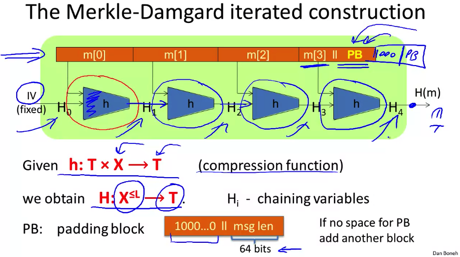

# Collision Resistant Functions

Hash functions! The hashes will always be x bits long, but can take gigabyte long messages, and yet no one can figure out the collisions. You can build HMACs with these as they verify order, and they're fast to compute. But if anyone can find even 1 collision, you're fucked.

## Generic Birthday Attack

Where we use statistics to make fun birthday-based facts, and break hashes. If our hash space is {0, 1}n, we can use the birthday attack to likely find a collision in O(2n/2) time, and almost definitely after a couple iterations. Luckily the size of SHA-256 and SHA-512 are so massive that we're waiting for the heat death of the universe, even with this trick ([Google already broke SHA-1](https://security.googleblog.com/2017/02/announcing-first-sha1-collision.html)).

## Merkle-Damgard Paradigm

This paradigm of `compression -> hash` is used in pretty much all hash functions today, and that's because of a theorem that states that if a little compression function is collision resistant, then so will the big-boy version.

## HMACs

[Computerphile video](https://youtu.be/wlSG3pEiQdc?si=Z8BYghtlQfxurogt). We use em everywhere, and we basically just hash with a key, then hash that again with another (mostly the same) key.

They however are vulnerable to verification timing attacks. `==` in most languages is a for loop that checks byte-by-byte, and rejects as soon as bytes aren't equal. So if you keep sending bad tags and timing how long it takes to reject them, you can start guessing the beginning of the tag, and keep guessing deeper in. You can defend against this by ensuring you always take the same amount of time to compare 2 strings (there's a couple clever ways to do this with bit manipulation, but a compiler might actually try to fight you on this).
