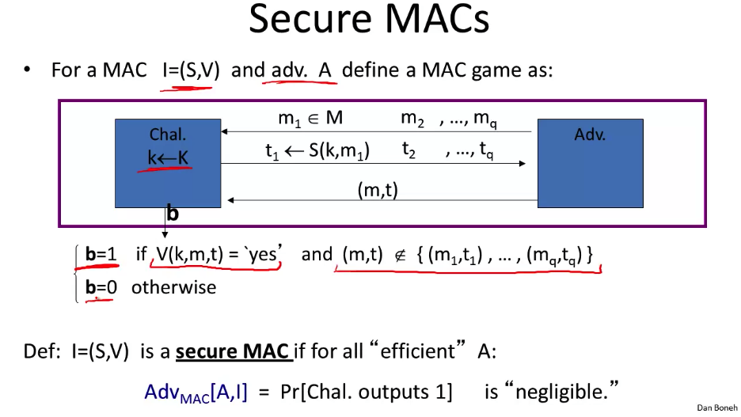
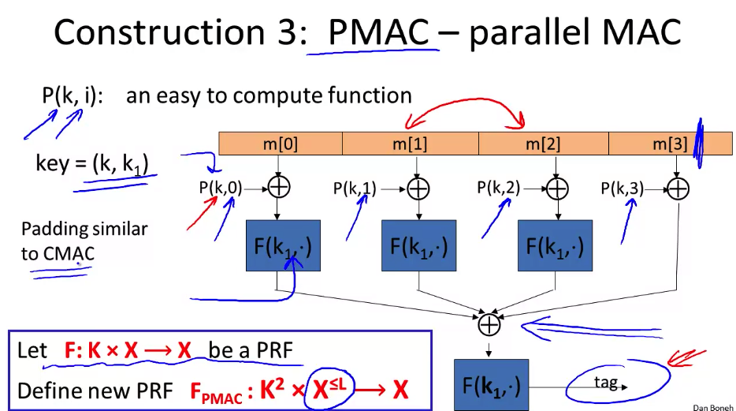

# Message Integrity

We've spent a lot of time talking about how to hide our messages' meaning from eavesdroppers, but how can we deal with those who will try to change the message?

## Message Authentication Code (MAC)

If we want to send a message to someone and ensure that it isn't being tampered with, we can use a shared key to generate a tag based on a message, and send this tag along with the message. Then our recipient can run a MAC validation function that can match the tag to the message. The shared key is necessary because we're fighting an adversary, not network errors. So the usual checksums and hashes could easily be replaced by an attacker, so we need a private key to deal with their trickery.

We can check the security of MAC (and similar schemes) by playing our usual semantic security game. In this case, our attacker is trying to execute a **chosen message attack** where he can send a bunch of messages, and get back the MAC tag, and given that info, what is the probability that he could construct a valid message-tag pair himself (called **existential forgery**)?

It follows that a secure PRF is generally also a secure MAC (assuming our output space is properly large), so AES is technically a MAC for 16-byte messages. But that's overkill, so in the real world we usually use [CBC-MAC](https://en.wikipedia.org/wiki/CBC-MAC) for banking, and [HMAC](https://en.wikipedia.org/wiki/HMAC) for pretty much everything else. Both of which convert a PRF designed for smaller messages into much larger PRFs.

## Encrypted CBC-MAC (or ECBC) and Nested MAC (NMAC)

ECBC is simple Cipher block chaining scheme, where we encrypt our message with a basic CBC setup, and use a different key on the final output to generate our tag. NMAC instead uses a [cascade function](https://en.wikipedia.org/wiki/Multiple_encryption) and appends an fpad before computing the tag. An important step in both of these is the final encryption that is used to generate the tag, as without it, the MAC is insecure, and this is a commonly missed step in real-world implementations. Both are also vulnerable if they've been used on too many messages without changing the key, as you've given your attacker a lot of message-cipher pairs they can execute collision (birthday) attacks on, where if we have enough messages, it becomes increasingly probable there will be a collision where two tags will equal each other, enabling some forgery attacks.

For these systems, we've used block-cipher approaches, which means that if we have messages that aren't exact multiples of block size, we need to do some padding. We can't just toss a bunch of 0s at the end of the message as that enables some existential forgery attacks. So we need an invertible function for our padding, which usually ends up with us needing to add a dummy block for reasons. An alternative is CMAC (the current NIST standard), a variant of CBC-MAC that uses 3 keys and a randomized padding function, XORing the keys with the final step in the cipher.

## Parallel MACs (PMAC)

Those previous methods are sequential by design, let's speed it up.

So now we can compute each message block in parallel, and end up with our tag at the end. This also lets us quickly re-compute the tag if a message is changed or added as we don't have to re-do the whole thing again.

## Carter Wegman MAC

All the previous MACs were PRFs that we fanangled with to get MAC signatures, but Carter-Wegman isn't a PRF and instead uses randomized values and some large prime numbers to compute a fast MAC that we can use many times with the same key.
